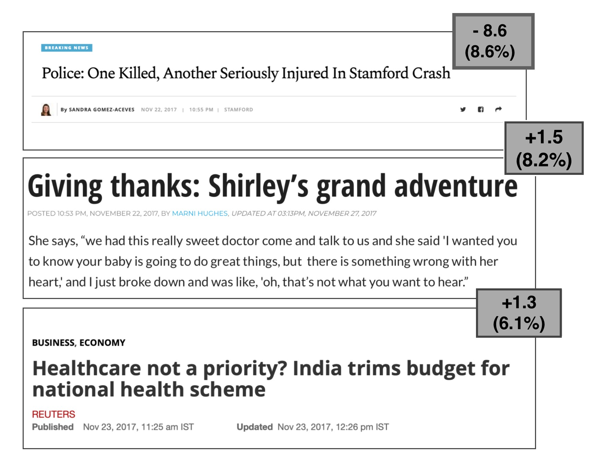
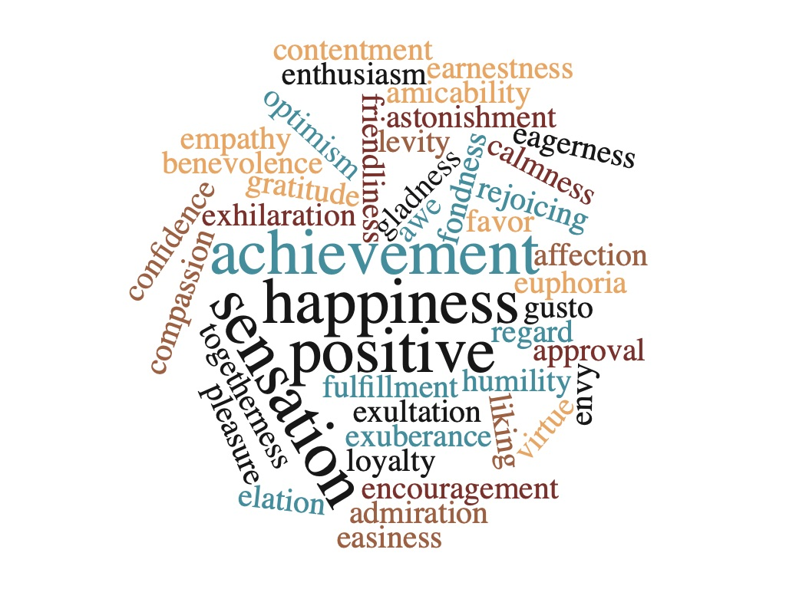

## Let's get emotional, we already got physical..

In our data story we explore conflicts all over the world and the public attention they receive. We harness the huge [GDELT 2.0](https://www.gdeltproject.org/) dataset consisting of events collected every day from thousands media channels of the world's news. We 
focus on sentiment analysis, and on the emotions conflicts tend to arouse with respect to their distinct features. We ask ourselves 
questions such as whether some regions are payed more attention than others, if news articles get more emotionally involved in conflicts 
occuring closer to our homes, or whether we tend to depict particular regions, nations or ethnicities by some steady emotional patterns. 
Throughout our research we hope to lift the shroud of how equally media report on the worlds conflicts and whether some bias exists.
{: style="text-align: justify"}

### Where does the news come from ?

<iframe src="https://matterhorn-ada.github.io/urls-log.html" width="100%" height="400px" frameBorder="0" scrolling="no"></iframe>
*GDELT harnesses numerous online news sources and most of them are connected to a particular country. The map show the number of sources 
per country on a logarithmic scale.*
{: style="text-align: justify"}

We can clearly see that the USA outranks other countries massively creating a great bias in our dataset which we further deal with. On 
the other hand, most of Africa and little populated areas such as Greenland show much lower representation by news sources which might 
lead to lower coverage of local events, a thing we dig into more later. There is obviously a strong relation between the number of news 
servers and the significance of the country in the world politics. 
{: style="text-align: justify"}

### Do we care about all ?
Are some countries ignored in the news? Is the number of conflicts taking place in a country in relation with the number of mentions in the media? Does it depend on where the conflict has happened?
{: style="text-align: justify"}

<iframe src="//plot.ly/~matterhorn_ada/3.embed" width="100%" height="400" frameborder="0" scrolling="no"></iframe>

*The number of events reported in the period 2015-2017 are grouped by the countries where they happened and the number of articles sums up all the GDELT news articles about these events. Typically, an event is mentioned in about 5 to 10 news articles, but this number can exceed 100. The size of the bubbles is proportional to the population of the country.*
{: style="text-align: justify"}

Again, it becomes visible that the dataset is biaised towards US-based events, followed by UK events after a big gap. Interestingly, there is a perfect correlation between the number of events happening and the number of articles that are reported (which becomes more evident when zooming in the figure). However, the number of people living in a country do not significantly influence the number of events, except for the very low-populated countries which tend to be in the left corner of the plot. This relation between the number of published articles and the number of events can be explained by the fact, that once the news reaches the web, it spreads in a more or less even fashion among the GDELT news sources, independent from where it originates. Hence, to answer the question whether some countries are ignored in the news, we tend to say no, however, some countries, such as the UK and the US, are comparewise overrepresented, which raises the questions what distinct features does an event require to be actually reported in a news source.
{: style="text-align: justify"}

This continuous bias that we see regarding the UK and the US might be due to the fact that only the first 15 minutes of event reportage are accounted when something happens, so major news sources that are at the forefront of reporting digital news such as the BBC or Fox News and CNN, are the main contributors for the accounted events.
{: style="text-align: justify"}

### Are emotions a measure of importance ?
Does our emotional reaction reflect the severity of an event? 
{: style="text-align: justify"}

<iframe width="100%" height="400" frameborder="0" scrolling="no" src="//plot.ly/~matterhorn_ada/24.embed"></iframe>

*The average tone of the articles reporting an event within the first 15 minutes it is first seen and the number of articles reporting 
the event within this short period. The countries indicate where the event happened. Only a fraction of the all the GDELT events in the 
2015-2017 period is plotted (0.01%).*
{: style="text-align: justify"}

We expected that high-impact events are associated with a larger spectrum of emotions, and that events such as an unexpected terror 
attack which affect a huge mass of people and are spreading rapidly in the news could be frequently seen in the GDELT dataset. However, 
as seen in the figure above, events tend to be labelled as emotionally neutral when reaching a certain level of importance. On the 
other hand, minor events reported by only a few sources are having a much larger variation in the reporting tone. While this might sound 
surprising at first, there may very well be a simple explanation: averaging the document tone over all kind of news articles, from 
neutral news agency reports, to more emotional boulevard articles, results in an average tone which tends to lose the distinct emotions 
of the individual sources. Nonetheless, the figure reveals that in general the news tend to be more negative than positive, and events with 
a significant number of mentions in the news are rather found on the negative side of the distribution.
{: style="text-align: justify"}

### How much is too much ?
Do we have a saturation limit? Does increasing number of conflicts make people feel worse and worse or is there some limit?
{: style="text-align: justify"}

<iframe width="100%" height="500" frameborder="0" scrolling="no" src="//plot.ly/~StudentUni/47.embed"></iframe>

*The emotion charge of a month worth of events. The events were grouped by month and country and plotted agains their emotion charge. The size of the points is referent to the y-axis value and we show a time evolution of the results.*
{: style="text-align: justify"}

Up to now we performed an analysis based on single events, big and small ones, here, however, we see the results when taking into account all the events that happened during a month in a country. What we surprisingly (or not) find, is that there are traces of a certain saturation regarding our emotions. To remember, the values you see onn the y-axis, the more they stray further away from 0, the more emotional the month was. Do not consider the values as an absolute value but as a relative one. If we do so, we can see that countries where more events are reported during a given month (big or small events) do not reach a value over 0.1 very often while countries with fewer events do. This lead us to believe people do have some kind of saturation, not reacting as much when there are many events.
{: style="text-align: justify"}

Some interesting observations can be taken from this graph, as for instance how India suddenly in August 2016 gets all emotional! With some internet research and GDELT url analysis we might associate this fact to a shooting that happened in a market in Balajan Tiniali.
Also, you can see that it is more common that when countries get more emotional, there is also a lower number of events which is seen by an important movement in the high left corner of the graph. For instance, there is a growth from March 2017 to April 2017 or from October 2017 to November 2017. Of course, when there is a big event (such as the India shooting) things get real emotional and can be an outlier in this behaviour. 
{: style="text-align: justify"}

### How large is our circle of empathy ? 
Are we emotionally biased? Do the number of conflicts or their distance from our home define our emotions? 
{: style="text-align: justify"}

If it is not the importance of an event that shapes the emotional tone of an article, is there maybe another feature? From the previous 
analysis, we gathered that it is rather difficult to associate emotions to the importance of an event, and that the overall positiveness and negativity of 
an event, as reported by the average tone, might be washed out if calculated by an aggregation of several news sources. We thus dig a step further, and focus on the 
individual news article reporting an event and we try to see whether the distance between an event and the news article source influence 
how we perceive the incident. We define an emotional charge which integrates the polarity and the tone of an individual article and look 
for a trend when plotted against the geographic distance of an event and its news source location. 
{: style="text-align: justify"}

<iframe width="100%" height="400" frameborder="0" scrolling="no" src="//plot.ly/~matterhorn_ada/6.embed"></iframe>

*The emotional charge of an article (measure of polarity and tone) vs the geographic distance between an event and the news source 
calculated by the [Great-Circle distance formula](https://en.wikipedia.org/wiki/Great-circle_distance). Only a fraction (0.01%) of the all the GDELT events in the 2015-2017 period is 
shown here.*
{: style="text-align: justify"}

The figure speaks for itself: the number of kilometres separating the event and the source is not in relation with the emotional charge. 
What about the instinctive impression that controversial events accompanied with emotional debates reach a larger fraction of the 
population? If we have a closer look at the figure, we see that events occurring in countries where generally a lot of events occur and 
which are rather countries playing an important role in the international politics have a higher chance to be mentioned all around the 
globe, than events happening in countries less known in the world (as example, we chose Malawi, a small African country). Hence, it 
seems as if a breaking news, independent of how emotional or not it is, can reach a large number of people. On the other hand, if we 
look for example at India, we see that it receives a lot of attention in its surroundings but much less further away.
{: style="text-align: justify"}

### Are we emotionally predictable ?
Can we observe patterns of emotions with respect to a country, religion or an ethnical group? Can we derive a model predicting emotions 
in case of a new conflict based on its specific features?
{: style="text-align: justify"}

The complexity behind what actually defines the emotions of a news article paper is obviously a function of the words that are used to 
describe the event. Words are abundant, and thousands of words are at the disposition of the news reporter. Attributing a tone to the 
document is done by GDELT through the count of positive minus negative words, which implies that the resulting tone is not necessarily 
the tone a human reader would attribute to the document. In addition, a neutral tone, meaning a zero score, could be the consequence of 
equally abundant negative and positive words (this issue is however mitigated by providing a polarity score: a high polarity score, but 
a zero average tone would point towards such a situation).
{: style="text-align: justify"}

Analysing the semantics of a document through the words is computationally expensive. We try to overcome the computational hurdle by 
predicting the emotions of a document by a simpler collection of features, such as the location of the event, who reported it, what kind 
of event was it, where there religious concerns, how many people were implicated, etc. That allows to see whether the emotional reaction of the news can already be 
predicted by just knowing basic facts of an event. The emotional reaction we use in the model is the tone given to the news paper article that we discretized into five categories.
{: style="text-align: justify"}

<iframe width="600" height="400" frameborder="0" scrolling="no" src="//plot.ly/~matterhorn_ada/18.embed"></iframe>

*The distribution of the tone which is reported by GDELT for each news article. We define the following categories: very negative: [-101, -10], negative: [-10, -5], mildly negative: [-5, 0], mildly positive: [0, 5], positive: [5, 100]*
{: style="text-align: justify"}

Applying a random forest machine learning algorithm and splitting on a training and test, we get an accuracy of around  56% on the test set.
While this accuracy is very low, the model does indeed give an indication of the emotional tone of an article and outperforms a random 
and a uniform model (the random model randomly predicts one of the average tones [42% of accuracy], and the uniform model only predicts the category “negative” which is 
the most prevalent [49% of accuracy]). The following figure shows to what extent the individual features of the model account for the response prediction:
{: style="text-align: justify"}

<iframe width="600" height="600" frameborder="0" scrolling="no" src="//plot.ly/~matterhorn_ada/12.embed"></iframe>

*The pie chart shows the importance of the features of the random forest model used to predict the tone of the articles. The most prevalent feature levels are as follows: Type of Event: [Kill, Protest, Arrest, Affect, Wound, Kidnap, Evacuation], Religion of the Actor: [Christianism, Muslim, Judaism, Buddhism], Human development index (of the country the event happened, defined by the [United Nations](http://hdr.undp.org/en/composite/HDI)) as a function of the GDP, the health and the educational status of a country: [Very High, High, Medium, Low]*
{: style="text-align: justify"}

The type of event contributes the most towards the tone an article gets, and interestingly the country that reports the event is more informative than the actual country where the event happened. 
{: style="text-align: justify"}

However, the model is clearly not satisfying and the question of how accurate the reported emotional tone actually is 
remains. Naturally, one would say, that events where someone got killed are more negative, but in the dataset such events also get 
attributed to positive emotions. On the other hand, events reporting the release of a hostages, have negative scores which looks 
surprising. Let’s look at some examples which all have the attribute “KILL” to understand this situation:
{: style="text-align: justify"}

*News headline taken from the GDELT dataset. Indicated is the measured tone of the article and its polarity in parentheses. Polarity gives an idea of how polar the speech was (it is the difference between a positive and negative tone that is used to build the average tone of the event)*
{: style="text-align: justify"}

The first news headline undoubtedly merits the strong negative score, and the second which describes a situation where a kid could have 
possibly died but survived thanks to medical intervention, shows a positive score. Both events have similar attributes (number of people, type of events, etc.), but the context is very different. Since GDELT is using positive and negative dictionaries of words to attribute the tone, and since the last document uses a more positive vocabulary than the first document, it could capture that the second news is indeed positive emotional, whereas our derived model, not knowing about all the circumstances of an event, is not able to do the distinction. The last example, however, results from a misclassification and shows that the word analysis is not a hundred 
percent reliable and representative of the actual document emotion, and underlines that simple words, without the context, define the attributed tone of the GDELT algorithm.
{: style="text-align: justify"}

Even though the aim of our emotion model is to predict emotional reactions from some essential raw features, we try to see if we can improve our model by adding to the features some words that were used in the news article to describe the event. To keep things simple, and without including all available GCAM words, the words that GDELT searches referent to some event regarding specific dictionaries, we integrate a small collection of positive words in our model. The result is striking: by only adding a few positive words, the accuracy could be improved by 7%. 
{: style="text-align: justify"}

*Positive words that were included as features into the random forest model.*
{: style="text-align: justify"}

This analysis highlights that only knowing basic facts of an event can provide a good indication of how it will be perceived in the media in the different countries. However, since our model uses as the response variable the emotional metrics provided by GDELT which relies on word counts and thus the data at disposition is very noisy, a precise model cannot be derived. Though, an important message from the analysis is that the choice of words used by the reporter, irrespective of the facts that are reported, determine the tone the document gets attributed by GDELT, which opens up the question, to what extent the words, and not the content, emotionally influence a human reader. 
{: style="text-align: justify"}

### What do the emotions say wordwise ?
Are some nations more emotional? Do we see sensitivity differences between some countries or actors?
{: style="text-align: justify"}

<iframe width="100%"  height="650" frameborder="0" scrolling="no" src="//plot.ly/~StudentUni/50.embed"></iframe>

*We make use of the GCAM feature in GDELT to associate certain words with countries. This plot represents some of the most used words by these countries. The size of the points refers to the year of that country (small (2015), medium (2016), big (2017)).*
{: style="text-align: justify"}

We get some interesting insights from this plot. First, we see that countries have their specific speech. You see that the words used by the US differs a lot by the ones used by Jamaica or Mexico. In addition, we notice some relations between the words. Looking for example at Mexico, the words "kill" and "death" are counted a lot in the articles, but none of them is used in the other 4 countries! The Syrian Arab Republic uses words, that a human reader might consider to be more emotional, such as "love" or "music", while Sweden focus on "power" and "captivation". When looking at the graph of saturation, and when only choosing Asian region countries, we do see that the Syrian Arab Republic is more emotional in general than the other countries. These relations show the potential of a thorough semantical analysis of this dataset, which could reveal many more interesting cultural differences and similarities between the countries in the world.
{: style="text-align: justify"}

In the following plot we see that most of the countries cluster together, which is expected, since news articles use a lot of common words, such as for instance the word "politics". Some countries tend to form small group of clusters, but no clear trend can be identified, which can probably be explained by the fact that we base our analysis on a constructed list of 800 words and not on the whole GCAM words which are not all interpretable.
{: style="text-align: justify"}

<iframe width="100%" height="500" frameborder="0" scrolling="no" src="//plot.ly/~matterhorn_ada/22.embed"></iframe>

*Principal component analysis of the word counts by country. We show the principal components 3 and 4 as they show more variance in the data than the first two. Each dot represents a country*
{: style="text-align: justify"}

### Conclusion

We analyzed the GDELT dataset of the news reported between 2015 and 2017, and the emotions that are attributed to these events. A huge biais towards US and UK based events is seen which mainly comes from the way GDELT operates: only the news articles seen within the first 15 minutes an event first appears are recorded, and the digital news servers the most up to date are located in these countries. Predicting emotions of events and identifying characteristical features that shape the emotional tone of a news article has revealed itself as a complex task. Emotions are related to words, and semantical analyses are challenging. On one hand, we relied on the emotional tone GDELT is providing, and which has revealed itself as not always reliable, and on the other hand we did not have important context information at disposition which can predefine the emotional reaction an event gets in the news. However, by analysing word collections and looking at emotional changes over time, we could see relations between emotions and countries, and identify an emotional saturation limit. 

Here we presented a big picture view of what the GDELT dataset reveals emotionwise, and we are confident that a more in-depth semantical analysis, as well as a focus on specific sub-events or a group of countries can reveal further insights such as cultural and emotional evolutions, as well as which countries have a similar way of reporting their news. 

Pedro Abranches de Figueiredo Simões de Carvalho  
Matyas Lustig  
Marie Sadler  

